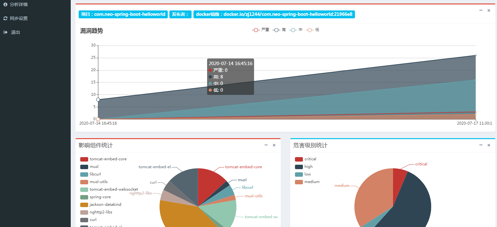
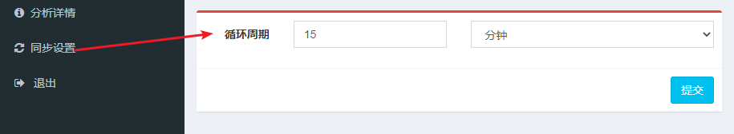

# Anchore_ui



## 介绍

**Anchore_ui**是一款用于展示Anchore Engine扫描结果的web系统。并且对anchore的扫描结果进行了增强，例如：对于java语言的补丁，anchore并不提供漏洞的修复版本，此系统弥补了这方面的问题。

## 支持平台

* Linux
* Windows

## 特点

* 提供jar包修复版本号
* 导出漏洞成excel文件
* 整合anchore扫描结果
* 查看依赖情况(暂时只支持maven)

## 安装指南

[](https://www.python.org/) 
[](https://www.mongodb.com/download-center?jmp=nav)

### 源码部署

**依赖**：项目运行依赖于mongodb，所以需准备好mongodb

***

**源码部署**步骤如下：


#### 1. 添加mongodb认证

**在 mongodb 服务器上**新建 db 用户，这里新建了一个用户名为`anchore_ui`密码为`123456`的用户。

```
# mongo
> use admin
> db.createUser({user:'anchore_ui',pwd:'123456', roles:[{role:'readWriteAnyDatabase', db:'admin'}]})
> exit
```

#### 2. 安装python依赖库

```
# git clone https://github.com/zj1244/anchore_ui.git
# cd anchore_ui
# pip install -r requirements.txt
```

#### 3. 修改配置文件

首先将`config.py.sample`复制一份重命名为`config.py`
```
# cp anchore_ui/config.py.sample anchore_ui/config.py
```

然后修改config.py里的配置信息：

```
# 按照实际情况mongodb的相关配置
MONGO_IP = "192.168.47.1"
MONGO_PORT = 27017
MONGO_USER = "root"
MONGO_PWD = "root"
# 按照实际情况修改anchore的相关配置
ANCHORE_API = "http://192.168.1.1:8228"
ANCHORE_USERNAME = "admin"
PASSWORD = "foobar"
```

#### 4. 启动

在程序目录下执行如下命令：

```
# python run.py
```

### 容器化部署

**依赖**：需提前准备好mongodb，关于mongodb的安装不再阐述，请参考：[mongodb安装](https://github.com/zj1244/beholder_scanner/blob/master/docs/mongodb.md)

#### 1. 构建镜像

新建个docker-compose.yml文件，复制粘贴如下内容，并根据实际情况修改mongo配置信息：

```
version: '3'
services:
  scanner:
    image: zj1244/anchore_ui:latest
    ports:
      - "8888:8888"
    restart: always
    network_mode: "host"
    environment:
      # 请修改以下redis和mongodb的配置
      MONGO_IP: 192.168.1.1
      MONGO_PORT: 27017
      MONGO_USER: anchore_ui
      MONGO_PWD: 123456
      ANCHORE_API: http://192.168.1.1:8228
      ANCHORE_USERNAME: admin
      ANCHORE_PASSWORD: foobar
```

#### 2. 启动容器

```
# docker-compose up -d
```

#### 3. 检查启动是否成功
如果输出类似信息则启动成功，此时可访问[http://ip:8888](http://ip:8888)，输入docker-compose.yml里的用户名密码来登陆
```bash
# docker logs $(docker ps | grep anchore_ui | awk '{print $1}')
[2020-07-16 Thursday 16:57] [INFO] Scheduler started
[2020-07-16 Thursday 16:57] [DEBUG] Looking for jobs to run
 * Serving Flask app "apps" (lazy loading)
 * Environment: production
   WARNING: Do not use the development server in a production environment.
   Use a production WSGI server instead.
 * Debug mode: on
[2020-07-16 Thursday 16:57] [INFO]  * Running on http://0.0.0.0:8888/ (Press CTRL+C to quit)
[2020-07-16 Thursday 16:57] [DEBUG] Next wakeup is due at 2020-07-16 17:04:54.782021+08:00 (in 461.596599 seconds)
```

## 使用指南

### 1. 配置定时任务

只需配置定时任务，用于定时从anchore同步扫描信息即可



## 示例

接下来将以一个示例来展示此系统如何工作


| URL    | http://192.168.1.1/dependency/result/                                                                                                  ||||
|--------|--------------------|------------------|-------------------|-------------------------------------------------------------------------------------------|
| 调用方式   | POST                                       |||                                                                                                        |
| 请求类型   | Content\-Type: application/json               |||                                                                                                     |
| 请求参数样例 | \{"dependency": "eHNzcw==", "docker\_url": "docker.io/zj1244/com.neo-spring-boot-helloworld:21966e8", "publisher": "abc"\} ||||
| 请求参数说明 | 名称                                                                                                                                                 | 类型     | 是否必填    | 描述             |
|        | docker\_url                                                                                                                                        | string | 是       | 镜像地址           |
|        | dependency                                                                                                                                         | string | 是       | base64加密过的依赖结果 |
|        | publisher                                                                                                                                          | string | 否       | 提交人            |
| 响应数据样例 | \{"code": 200,"msg": "ok"\}   |||                                                                                                                     |
| 响应数据说明 | 名称                                                                                                                                                 | 类型     | 是否必填    | 描述             |
|| code   | int                                                                                                                                                | 是      | 200表示成功 |
|| msg    | string                                                                                                                                             | 是      | 描述信息    |


### 2. 展示jar包依赖情况（可选）

